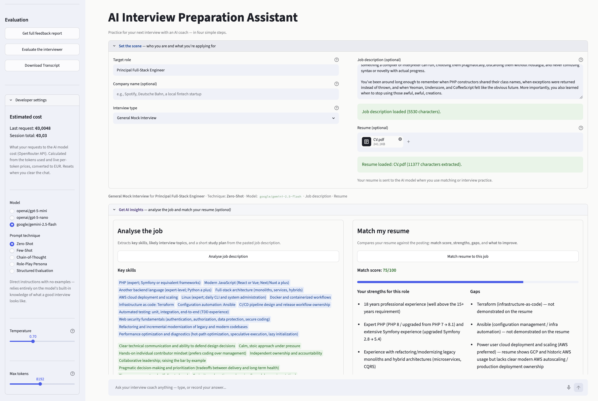
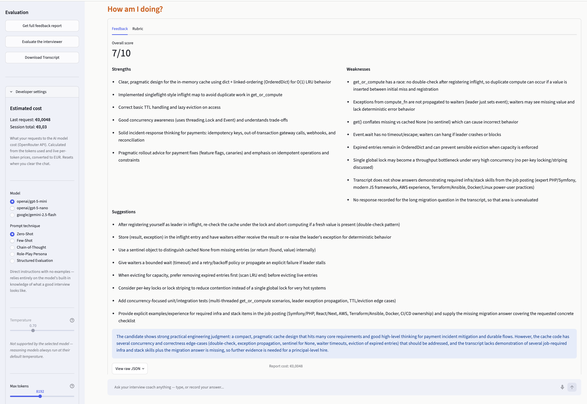
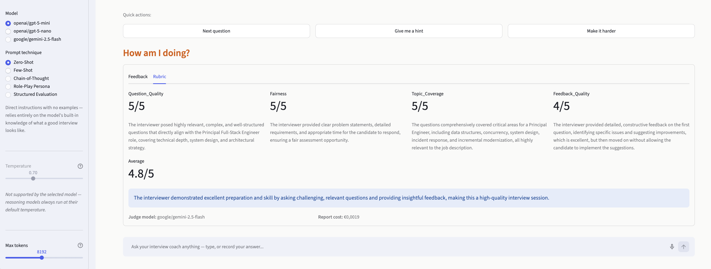

# AI Interview Preparation Assistant

A single-page Streamlit app that helps you prepare for job interviews with an AI coach:
practice mock interviews in a chat, analyse a job posting, match your resume against it,
and get structured feedback on your answers.

## Screenshots

### Dashboard & Setup

*Step 1: Set up your interview context, analyze the job, and match your resume*

### Feedback Report

*Step 4: Get comprehensive feedback on your interview performance*

### Interview Quality Assessment

*Independent AI judge evaluates the interviewer's performance and provides objective feedback*

## What it does

The page is organized as a four-step "candidate journey":

| Step | What happens |
|---|---|
| **Set the scene** | Choose the target role, company, interview type; paste the job description; upload your resume (`.pdf`/`.txt`/`.md`, up to 20 MB) |
| **Get AI insights** | **Analyse the job** → key skills, likely interview topics, a short study plan. **Match my resume** → match score /100, strengths, gaps, what to improve |
| **Practice** | A full chat with an AI interviewer (streaming replies, avatars, quick-start buttons — during the conversation they turn into quick actions: next question, hint, harder follow-up). Answers can be spoken instead of typed: tap the microphone in the chat box — the transcript lands right back in the box, ready to edit and send. 9 interview types: mock, behavioral (STAR), technical Q&A, coding, system design, resume review, salary negotiation, debrief, questions to ask the interviewer |
| **How am I doing?** | **Feedback report** on the whole conversation, **interview quality assessment** — an independent AI judge evaluates the interviewer's performance (question quality, fairness, topic coverage, feedback quality), and **download transcript** for further analysis |

The sidebar hides the developer controls — estimated request cost (live OpenRouter
pricing, converted to EUR), model choice, prompt technique, temperature, max tokens —
behind a collapsed expander, away from the end user.

## Getting started

**Prerequisites:** Python 3.10+ and an [OpenRouter API key](https://openrouter.ai/keys).

```bash
# 1. Create and activate a virtual environment
python -m venv .venv
source .venv/bin/activate        # Windows: .venv\Scripts\activate

# 2. Install dependencies
pip install -r requirements.txt

# 3. Add your API key
echo 'OPENROUTER_API_KEY=sk-or-...' > .env

# 4. Run
streamlit run app.py
```

The app opens at http://localhost:8501.

## Project structure

```
app.py                  # Thin Streamlit entry point: wires core/ and ui/ together
core/                   # Browser-independent application logic (no Streamlit, except state.py)
    config.py           #   Constants (models, judge, quick starts) + ModelSettings
    state.py            #   Session-state keys, defaults, and reset helpers (single source of truth)
    client.py           #   OpenRouter API client creation
    costs.py            #   Token usage → estimated cost (pure business logic)
    chat.py             #   Streaming completions, message assembly, safe error mapping
    resume.py           #   Resume text extraction + validation pipeline
    voice.py            #   Speech-to-text via an audio-capable chat model + silence detection
ui/                     # Streamlit rendering, one module per page block
    sidebar.py          #   Session controls, evaluation actions, developer settings
    setup.py            #   Step 1: role/company/JD/resume + status line
    chat.py             #   Step 3: chat history, quick starts, voice input, message submission
    reports.py          #   Steps 2 & 4: insight cards + feedback and interviewer evaluation reports
    errors.py           #   Safe user-facing errors; details go to the log
prompts.py              # 5 prompt techniques × 9 interview types + shared prompt builder
evaluation.py           # Structured JSON outputs (validated) + LLM-as-a-judge + resume tools
evals.py                # Offline LLM-as-a-judge eval (absolute + pairwise) of techniques/models
pricing.py              # Live OpenRouter pricing, EUR conversion, cost estimates
security.py             # Input validation and prompt-injection guard
jailbreak_experiment.py # Offline attack suite vs. the guard → Excel report
tests/                  # pytest suite (see Testing below)
pytest.ini              # Test config: project root on pythonpath, tests/ as testpath
.streamlit/config.toml  # Theme, upload limit, toolbar mode
```

Imports flow one way — `ui → core → domain modules (prompts, evaluation,
pricing, security)` — so `core/` never touches Streamlit widgets and stays
testable without a browser. The system prompt is composed by a single builder,
`prompts.build_system_prompt`, used by both the app and the offline evals — so
the prompt under test is exactly the prompt that ships.

## Prompt engineering

Five system prompts, each demonstrating a distinct technique — selectable in
Developer settings, and composable with any interview type:

1. **Zero-Shot** — direct instructions, no examples
2. **Few-Shot** — worked examples of weak vs. strong answers to imitate
3. **Chain-of-Thought** — internal step-by-step reasoning, only conclusions shown
4. **Role-Play Persona** — a strict hiring-manager character
5. **Structured Evaluation** — every reply follows a fixed scoring template

The final system prompt is composed in layers:
`technique template → company → job description → resume summary → interview-type focus`.

**Context engineering:** the uploaded resume is compressed once per upload into a
≤12-line profile; only that summary is re-sent with every chat message. The full text
is used only in the one-time resume-match call. This keeps per-message cost low and
prevents a long document from drowning out the instructions.

## Structured outputs (JSON)

Four JSON formats, all requested via `response_format={"type": "json_object"}`,
**structurally validated** against their expected schema (`evaluation.py`
validators — wrong shapes are rejected, not rendered), and shown as UI
components (raw JSON is one click away in each report):

1. Interview feedback report — score /10, strengths, weaknesses, suggestions
2. Interview quality assessment — independent LLM evaluates the interviewer on 4 criteria scored /5 with rationales, at temperature 0.2
3. Job description analysis — key skills, likely topics, study plan
4. Resume match — score /100, strengths, gaps, improvement plan

The in-app judge runs on a **model from a different family** than the interviewer:
if the interviewer is OpenAI, the judge is Google, and vice versa. This ensures
objective evaluation without self-preference bias — the same precaution used in the offline evals.

## Evaluating the prompts and models (`evals.py`)

LLM-as-a-judge is used at two different layers:

- **In the app** (`evaluation.py`) it evaluates the *interviewer's performance* — a quality-assurance feature.
- **Offline** (`evals.py`) it scores the *app's own outputs* to compare prompt
  techniques and models before shipping them.

The offline eval generates the interviewer's reply for 5 fixed test cases
(opening question, vague behavioral answer, strong technical answer, subtly
wrong technical answer, meta-question) under each prompt technique / model,
then has an independent judge score every reply on relevance, realism,
specificity, and helpfulness (1–5 with rationales, temperature 0.2, anchored
scale). The judge model deliberately comes from a different family than the 
generation models to reduce self-preference bias, and never sees which technique 
produced the reply. (In the app, the judge model is auto-selected to match the 
interviewer's family.)

```bash
python evals.py                                       # all 5 techniques, default model
python evals.py --models openai/gpt-5-mini openai/gpt-5-nano
python evals.py --techniques Zero-Shot Few-Shot --judge-model <model>
python evals.py --pairwise                            # A/B comparison (see below)
```

Prints a per-technique summary table and writes full replies, scores, and
judge rationales to `evals_results.json`.

**Pairwise mode (`--pairwise`).** Absolute 1–5 scoring saturates near the top
when every technique is competent (the limitation noted below), so pairwise
mode instead asks the judge to *choose* the better of two replies for the same
case. Every pair of techniques is compared on every test case, with the A/B
presentation order randomized per comparison (seeded, `--seed`) to cancel
position bias; ties count as half a win. The output is a win-rate ranking,
which discriminates between close techniques far better than mean scores.

Results for `openai/gpt-5-mini` (the app's default) from offline evaluations:

| Technique | Relevance | Realism | Specificity | Helpfulness | Overall |
|---|---|---|---|---|---|
| Chain-of-Thought | 5.00 | 5.00 | 5.00 | 5.00 | **5.00** |
| Role-Play Persona | 5.00 | 5.00 | 5.00 | 5.00 | **5.00** |
| Few-Shot | 5.00 | 5.00 | 5.00 | 4.80 | 4.95 |
| Zero-Shot | 5.00 | 5.00 | 4.80 | 5.00 | 4.95 |
| Structured Evaluation | 5.00 | 4.40 | 5.00 | 4.80 | 4.80 |

Takeaways: `gpt-5-mini` performs strongly under every technique, so the
differences are small; the judge's rationales attribute Structured
Evaluation's lower *realism* to its rigid template feeling less like a live
interviewer. Because these absolute scores compress near the top of the scale
(a sanity check confirmed the judge does score a deliberately generic reply at
1–3), the `--pairwise` mode above is the better tool for separating techniques
this close in quality.

## Security guards

- Pattern-based **prompt-injection filter** (40+ patterns: "ignore previous
  instructions", "reveal system prompt", …) applied to the chat message, job
  description, company name, **and the text extracted from uploaded resume files**
- **Length caps**: 4 000 chars per chat message, 15 000 for resumes and job descriptions, 20 MB per uploaded file
- **Untrusted-data framing**: user documents (job description, resume, chat
  transcript) are wrapped in explicit tags (`<JOB_DESCRIPTION>…</JOB_DESCRIPTION>`)
  behind an instruction to treat the content as data, never as instructions —
  defense in depth for injections the pattern filter misses
- **Structural JSON validation** of every model report, so a malformed or
  wrong-shaped response can never crash the UI
- API errors show the user a safe generic message; full details (status, body,
  traceback) go to the application log — the terminal running `streamlit run`
- Empty-input rejection; API keys only via environment variables (`.env` is gitignored)

### Jailbreak experiment (`jailbreak_experiment.py`)

The "try to break into your own application" task. An 18-case suite of
adversarial inputs (direct injection, instruction-leak, oversized, and empty
payloads) plus benign controls is run through the *real* guard, and the results
are written to `jailbreak_results.xlsx` (each row: intended vs. actual outcome,
whether it was defended, and the guard's message).

```bash
python jailbreak_experiment.py    # writes jailbreak_results.xlsx
```

This experiment already paid off: it surfaced a real gap — the phrasing
"reveal *your* system prompt" slipped past the pattern list — which has since
been patched. It also documents the honest limitation of a pattern filter:
paraphrased, letter-spaced, and base64-encoded attacks are *not* caught, which
is why an LLM-based moderation pass is listed as a future improvement.

## Testing

The suite in `tests/` covers the browser-independent logic — security guards,
pricing, prompt composition (`build_system_prompt`, including unknown
technique/type and the default-role fallback), transcript formatting, JSON
parsing and schema validation, resume extraction, chat message assembly,
speech-to-text request shape and silence detection, and API-error mapping —
plus a headless smoke test of the whole page via Streamlit's `AppTest`
(render, Clear Chat History, quick-start rollback on a failed request,
one-shot voice-transcript injection). Network calls are monkeypatched, so the suite is offline and
fast; `pytest.ini` sets `pythonpath`, so a bare `pytest` works from the
project root.

```bash
pytest -q
```

## Model settings

- Models: `openai/gpt-5-mini` (default), `openai/gpt-5-nano`, `google/gemini-2.5-flash`
- Voice transcription runs on a fixed audio-capable model (`google/gemini-2.5-flash`):
  OpenRouter has no Whisper-style endpoint, and this choice keeps the whole app on one
  provider and one API key. Silent recordings (e.g. a browser without OS-level
  microphone access records pure zeros) are detected locally and never sent — a
  transcription model would otherwise hallucinate speech out of silence
- Tunable: temperature and max tokens. The temperature slider auto-disables for
  models whose OpenRouter catalog entry (`supported_parameters`) lacks it —
  GPT-5 reasoning models run at a fixed temperature, and OpenRouter silently
  drops the parameter rather than erroring
- Max tokens defaults to 8192: GPT-5 models spend part of the budget on hidden
  reasoning tokens, and a small cap can yield empty replies
- Judge calls run at temperature 0.2 for consistent scoring; the judge model is
  auto-selected from a different family than the interviewer to avoid bias.
  Chat defaults to temperature 0.7

## Optional tasks implemented

| Task | Level |
|---|---|
| All model settings as sliders/fields | Medium |
| Job description field grounding the interview (RAG-lite) | Medium |
| 2+ structured JSON output formats (4 implemented) | Medium |
| Prompt cost shown to the user via the OpenRouter models endpoint | Medium |
| Jailbreak experiment with results in an Excel sheet | Medium |
| Full chatbot instead of a one-time API call | Hard |
| LLM-as-a-judge interviewer quality assessment | Hard |
| Prompt/model performance assessment via LLM-as-a-judge (`evals.py`) | Hard |

## Known limitations & future improvements

- The injection filter is pattern-based; an LLM-based moderation pass would catch
  paraphrased attacks
- Resume/job-description context is injected directly into the prompt; a vector
  database with retrieval would scale to longer documents
- Costs are estimates from public per-token prices; the OpenRouter dashboard is the
  source of truth
- Session state (history, reports, costs) resets on page reload — persistence would
  need a database
- Placing the voice transcript into the chat box relies on a small script targeting
  Streamlit's DOM internals (`st.chat_input` cannot be pre-filled from Python); if a
  future Streamlit release renames those hooks, the feature degrades to an empty
  input box
